<div style="display: flex; align-items: center; justify-content: center;">
  <a href="https://play.google.com/store/apps/details?id=com.teumteum.teumteum&pcampaignid=web_share">
    
  </a>
  <a href="https://www.behance.net/gallery/191510163/%08TEUMTEUM-IT-Career-Growth-Networking-Service" style="margin-left: 10px;">
    
  </a>
</div>


# 목차 ✍🏻
---
1. [틈틈의 시작 🏃🏻‍♀️](#틈틈의-시작-)
2. [틈틈의 기능 🤔](#틈틈의-기능-)
3. [틈틈의 개발 정보⚒️](#틈틈의-개발-정보)
4. [틈틈을 개발하며 고민했던 이슈 🤝](#틈틈을-개발하며-고민했던-이슈-)
5. [틈틈하며 이런 부분에서 성장을 이뤘습니다 💫](#틈틈하며-이런-부분에서-성장을-이뤘습니다-)

포스트에서 원하는 부분을 눌러 빠르게 읽어보세요! 

<br>


## 틈틈의 시작 🏃🏻‍♀️
---

11월부터 2월까지 디프만에서 틈틈이라는 프로젝트를 진행했습니다.
해당 프로젝트는 IT 업계에서 '커피챗'이라는 만연한 문화를 차용하여 **보다 쉽게 네트워킹을 할 수 있도록 하는 방법이 없을까?** 하는 아이디어에서 시작했습니다.

뿐만 아니라 처음 보는 사람들과의 어색함을 풀어내는 방법을 **chatGPT** 사용하여 참여하는 사람들의 관심사에 관련된 대화 주제를 카드 뽑기라는 재밌는 방법으로 풀어냈습니다. 

<br>

## 틈틈의 기능 🤔
---

<h3 style="background-color: #724CF9; color: #ffffff; padding: 0.5em;">No.1 모임 생성</h3>

틈틈의 주 키워드는 바로 **모임** 입니다.

1. 고민나누기 
2. 모여서 픽업
3. 스터디
4. 사이드 프로젝트 

네 가지의 토픽을 선택하여 원하는 장소에, 원하는 모임을 생성할 수 있습니다


<h3 style="background-color: #724CF9; color: #ffffff; padding: 0.5em;">No.2 모임 참여</h3>


<div style="display: flex; align-items: center; justify-content: center;">
    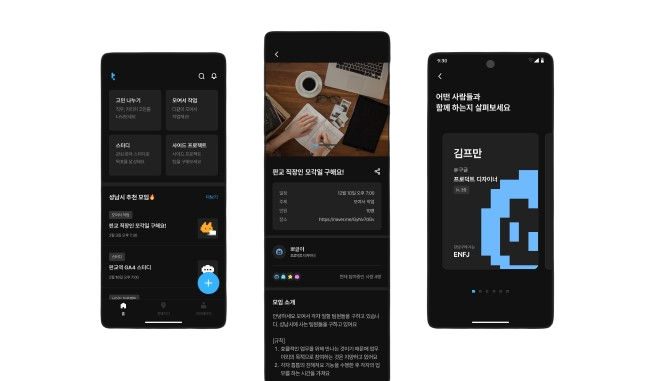
    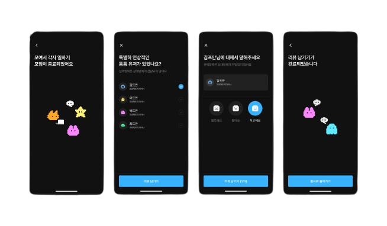
</div>

**모임을 생성하는 것이 부담스럽다!** 하는 분들은 생성된 모임에 참여할 수 있습니다. <br>
원하는 지역을 변경하여 다른 지역의 모임도 참여할 수 있으며, 모임에 참여하는 참가자들의 프로필을 미리 확인할 수 있습니다.<br>
모임이 종료되면, 참가자들에게 리뷰를 남겨 더 클린한 네트워킹 문화에 한 줌 기여할 수 있습니다 😎


<h3 style="background-color: #724CF9; color: #ffffff; padding: 0.5em;">No.3 관심사 발견, 틈틈 채우기 🥰</h3>

<div style="display: flex; align-items: center; justify-content: center;">
    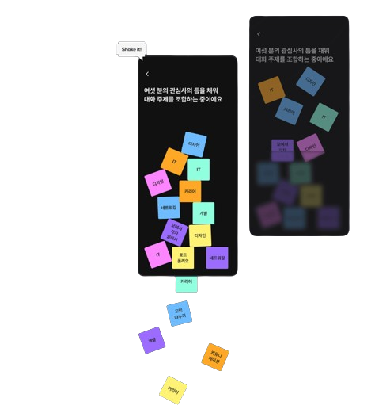
    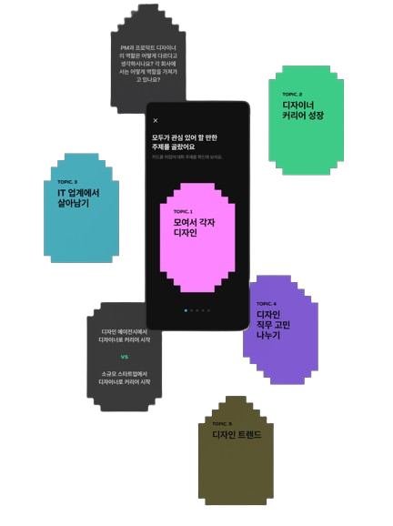
</div>

**처음 보는 사람과 무슨 대화를 하지?** 고민하지마세요. <br>
기기를 흔들면 참여자들이 공통적으로 가지고 있는 관심사를 기반으로 대화 주제를 생성합니다. <br>
해당 아이디어는 감정을 섞어 칵테일을 만드는 **모지또**의 아이디어를 차용해보았습니다. 


<h3 style="background-color: #724CF9; color: #ffffff; padding: 0.5em;">No.4 주변에 있는 틈틈 유저 훔쳐보기 🤫</h3>

<div style="display: flex; align-items: center; justify-content: center;">
    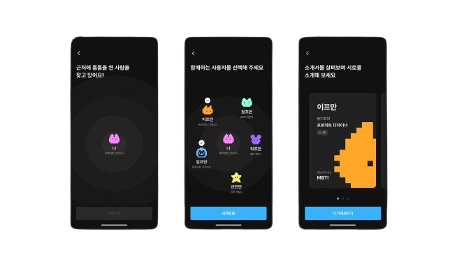
</div>

틈틈은 **사용자 위치 기반 서비스**입니다. <br>
주변에 틈틈을 사용하는 또 다른 사용자를 찾고, 관심사와 목표를 확인해보세요


<br>

## 틈틈의 개발 정보⚒️
---

<div style="width: 100%; display: flex; justify-content: center; overflow-x: auto;">
    <table style="width: 100%; max-width: 1000px; margin: auto; border-collapse: separate; border-spacing: 10px;">
        <tr>
            <th style="width: 25%; color:#724CF9">이강민</th>
            <th style="width: 25%; color:#724CF9">김우남</th>
            <th style="width: 25%; color:#724CF9">신민서</th>
            <th style="width: 25%; color:#724CF9">김세연</th>
        </tr>
        <tr>
            <td style="text-align: center;"></td>
            <td style="text-align: center;"></td>
            <td style="text-align: center;"></td>
            <td style="text-align: center;">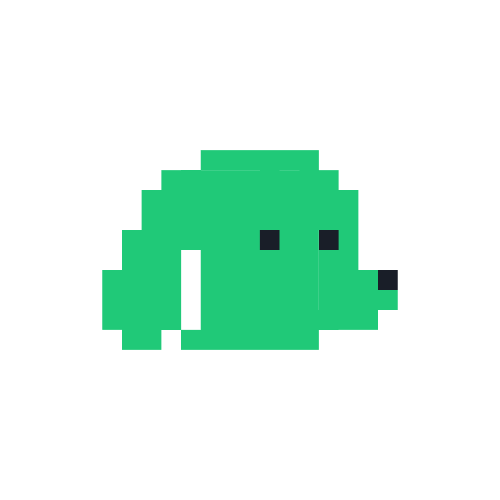</td>
        </tr>
        <tr>
            <td style="text-align: center;">모임 참여 & 유저 리뷰</td>
            <td style="text-align: center;">공통 관심사 찾기</td>
            <td style="text-align: center;">모임 생성 & 마이페이지</td>
            <td style="text-align: center;">로그인 & 자기소개 카드</td>
        </tr>
    </table>
</div>

<br>

틈틈은 귀엽고 멋진 **열 명의**들이 두 달이라는 기간 동안 꾸준히 달려 완성된 애플리케이션입니다!
하지만 포스트의 길이 조절 관계로 안드로이드 팀원들과 맡은 역할만 남겨 놓은 점 이해 부탁드립니다 🫠

<details>
  <summary>주요 기술 스택 및 프로젝트 구조는 다음을 눌러 확인해주세요</summary>

  
<div style="align:center">
    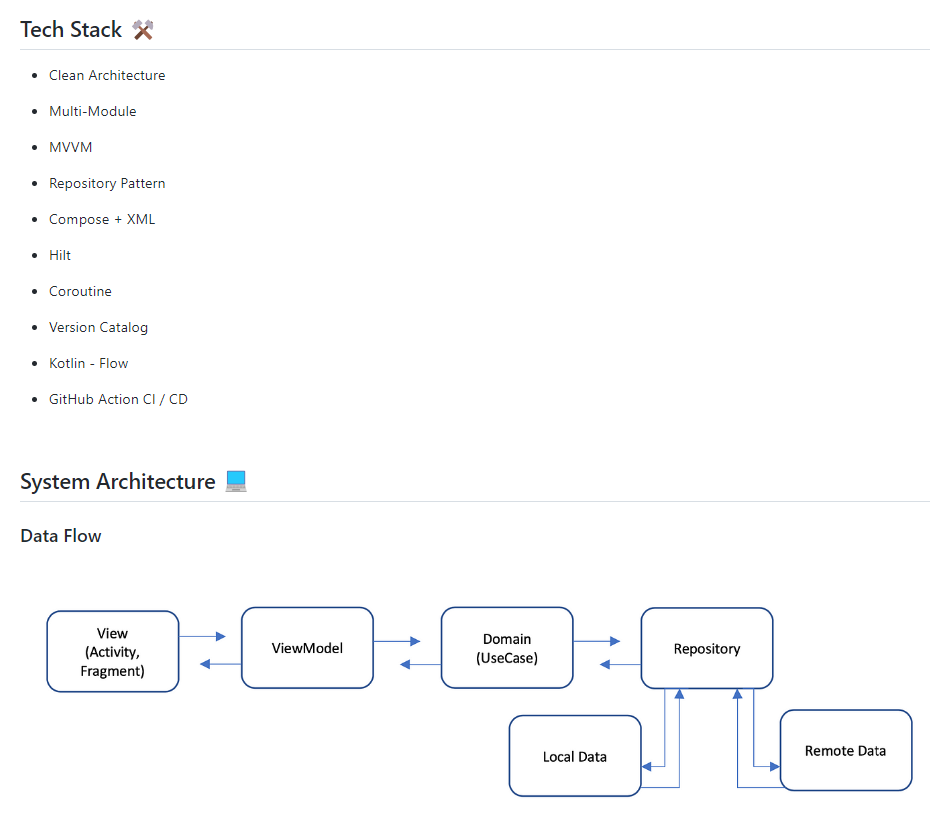
    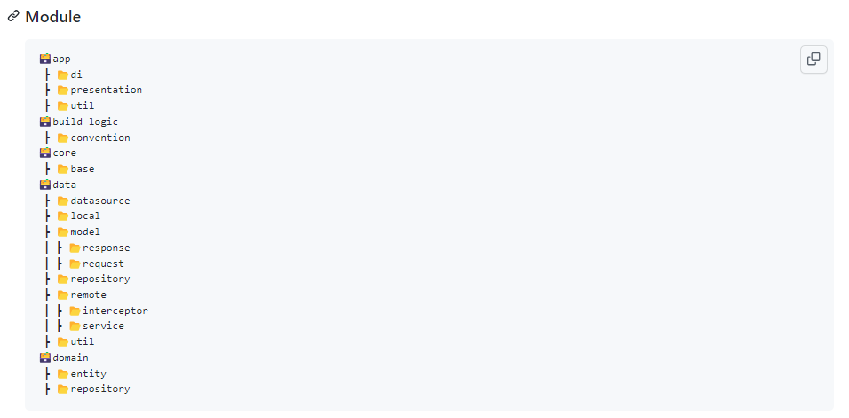
</div>

</details>


<br>

## 틈틈을 개발하며 고민했던 이슈 🤝
---

<h3 style="background-color: #724CF9; color: #ffffff; padding: 0.5em;"> 🤔 나 아직 컴포즈 연습 중인데.. 팀원 중 절반 이상이 XML 유저?</h3>

프로젝트 기획 단계에서 팀원들과의 기술 스택을 정하는 도중, 기술 스택이 일치하지 않는다는 사실을 깨달았습니다. <br>

<div style="width: 100%; display: flex; justify-content: center; overflow-x: auto;">
        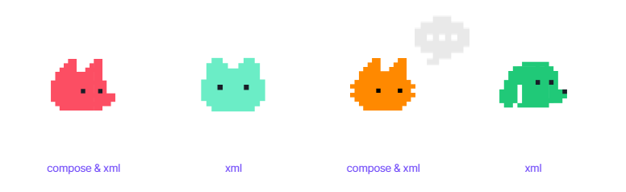
</div>


공통으로 사용할 수 있는 xml을 채택하는 것이 보편적인 선택이나, 컴포즈를 배우기 위해 연습 중이었던 저에게 다시 xml을 사용하는 것은 배움을 적용하는 기회를 놓치는 것과 같다고 판단했습니다. 

따라서, 팀원과의 조율을 통해 xml 위에 Compose View를 올려 **xml과 compose가 공존하는 프로젝트**를 진행하기로 결정했습니다. 실제로 두 가지의 스택이 프로젝트에 공존하는 사례가 존재(ex. xml을 compose로 이전)하고 이에 대한 가이드가 문서화가 잘 되어있는 것을 보았을 때 **의미 있는 도전**이 될 것이라 생각했기 때문입니다.  <br>


UI를 구성하고, compose view에 UI를 바인딩 하는 과정은 순조롭게 진행되었으나, 개발 과정에서 몇 가지의 어려움이 존재했습니다.

<h3 style="background-color: #AA92FF; color: #ffffff; padding: 0.5em;"> 🚩 Problem 1 : 상태 관리와 스크린 전환</h3>

Compose와 XML을 하나의 프로젝트에서 사용하기 위해서는 동일하게 레이아웃 파일을 생성한 다음, 해당 파일에 compose view라는 요소를 주입하여 코틀린으로 작성된 Compose 화면을 Compose View에 바인딩 하는 과정을 거칩니다. <br> 하지만 **하나의 화면에서 다양한 상태에 따라 다른 뷰를 표시 해야 할 때**, 상태 관리와 UI 업데이트 방식을 고민해야합니다. <br>

모임 생성 플로우에서 고민과 해결책은 다음과 같았습니다.

<div style="display: flex; justify-content: space-between;">

<ul>
    <li> 프로그래스바와 상단바가 고정적으로 존재한다.</li>
        <ul>
            <li>XML을 사용하여 프로그래스바와 상단바를 구성한다.</li>
            <li>Compose 내부에 두 가지를 포함하여 구성한다.</li>
        </ul>
    <br>
</ul>

<ul>
    <li> 모임 생성 플로우는 총 8단계이다.</li>
        <ul>
            <li>화면마다 별도의 Fragment를 생성한다.</li>
            <li>각 단계마다 state를 할당하여 state에 따라 화면을 업데이트한다.</li>
        </ul>
</ul>
</div>

두 가지 고민을 거쳐 하나의 프래그먼트 구성 방법에 대한 결정을 내렸습니다.

모임 생성 프로세스에는 토픽 선택부터 최종 생성 확인까지 8개의 화면이 존재합니다.<br>

```kotlin
    //MoimViewModel
    private val _screenState = MutableStateFlow<ScreenState>(ScreenState.Topic)
    val screenState: StateFlow<ScreenState> = _screenState.asStateFlow()

    //MoimFragment
    binding.composeMoim.setContent {
        val screenState by viewModel.screenState.collectAsState()
            when (screenState) {
                ScreenState.Topic -> MoimCreateTopic(viewModel) { goFrontScreen() }
                ScreenState.Name -> MoimCreateName(viewModel) { goFrontScreen() }
            ... 이하 생략 
            }
        }
```


화면의 개수만큼 레이아웃을 생성하여 navigation을 연결하는 것은 코드의 재사용성과 상태 공유 측면에서 적절하지 못한 방안입니다. 따라서 **하나의 fragment에 프로세스 단계마다 state를 enum class로 부여**하여 **ViewModel에서 stateflow로 관리**하는 방법을 적용했습니다. 

프로그래스 바를 compose 화면 안에 구성할 경우, 진행 상황에 따라 부드럽게 증가해야할 progress가 일정 부분 끊기는 듯한 모션을 보였고 이는 쉽게 XML에 compose View, progress Bar를 둘 다 배치하여 해결했습니다.

하지만 이와 반대로 상단 바와 같은 경우, 같은 방식으로 XML에 구성요소로 배치하면 버튼이 존재하는 **하단 부분이 특정 기기에서 잘리는 현상**이 발생해 **Compose 내부에 상단 바를 배치**하는 결정을 내렸습니다. 

상단바를 통해 이전 화면으로 이동하는 형태가 자주 사용되었기 때문에, **TeumScaffold를 컴포넌트화**하여 화면에 따라 onClick 함수를 부여했습니다.

이러한 방안을 적용하게 되면서, 화면 상태와 UI 업데이트를 보다 효율적으로 관리할 수 있었습니다.

<h3 style="background-color: #AA92FF; color: #ffffff; padding: 0.5em;"> 🚩 Problem 2 : UI 재사용, 어떻게 하는건데? </h3>

<div style="width: 100%; display: flex; justify-content: center; overflow-x: auto;">
        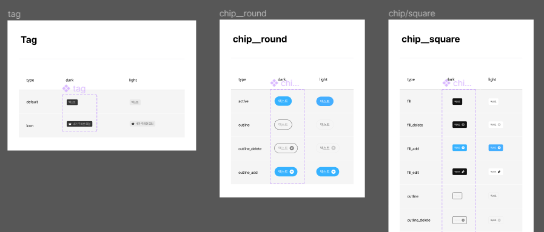
        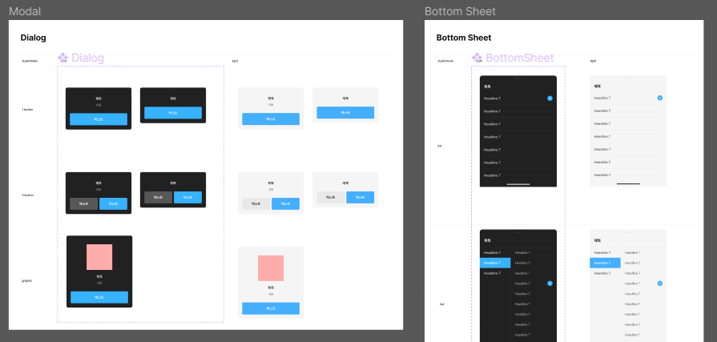
</div>

디자인 팀에서 많은 시간을 공들여 제작해준 디자인 시스템의 컴포넌트는 약 130여개로 구성되어 있었습니다. 하지만 모든 디자인 시스템을 컴포넌트화 하여 재사용 하는 것은 두 가지의 우려 사항이 존재했습니다.

<ul>
    <li> 모두가 해당 컴포넌트를 사용하지 않는다. </li>
    <li> 팀원의 기술 스택이 다르다</li>
</ul>

컴포넌트화를 진행하는 이유는 개발 시간 단축이지만, 개발 시간이 짧게 주어진 지금과 같은 상황에서는 모든 디자인 시스템을 컴포넌트화 하는 것이 오히려 시간 소요적인 선택일 수도 있다는 생각을 했습니다. <br>

특정 디자인 시스템(바텀시트, 스낵바)와 같은 경우 XML을 사용하는 팀원과 함께 사용해야했기 때문에 Compose을 사용하는 팀원과 공유하고 자주 쓰이는 디자인 시스템(ex. 버튼)은 컴포넌트화하고, XML을 사용하는 팀원과 공유하는 디자인 시스템(ex. 바텀시트, 스낵바)은 UI 업데이트과 동일하게 viewModel에서 stateFlow로 관리하는 방식을 채택했습니다.

#### 🪄 Compose: 컴포저블을 stateless하게 관리하자 

특정 컴포저블을 선언하는 과정에서 내부에서 상태를 관리하거나 viewModel을 주입하는 의존성을 가지게 되면 Compose의 큰 장점인 재사용의 의미가 사라지게 됩니다. 
따라서 여러 화면에서 사용할 컴포저블은 stateless하게 유지해 해당 컴포저블 내부에서 상태를 변경하지 않도록 만들어줄 필요성이 있습니다.

```kotlin
    //TmInputField
    @Composable
    fun TmInputField(
        @StringRes text:Int,
        @StringRes text_error: Int? = null,
        value:String = "",
        onValueChange: (String) -> Unit = {},
        isError:Boolean = false,
        modifier: Modifier = Modifier
    ) {
        OutlinedTextField(
            modifier = modifier
                .then(Modifier.fillMaxWidth())
                .height(54.dp),
            value = value,
            onValueChange = onValueChange,
            interactionSource = interactionSource,
        )
    }
```

위와 같이 텍스트 필드를 stateless하게 선언하면 상위 컴포저블에게 상태를 전달 받아 변경 사항을 적용하기 때문에 **의존성은 낮아지고, Compose를 안정적으로** 다룰 수 있게 됩니다.

#### 🪄 XML: state를 적용합니다, 하지만 오버라이딩이 필요한 

<div style="width: 100%; display: flex; justify-content: center; overflow-x: auto;">
        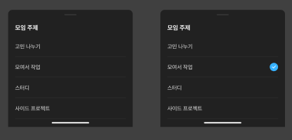
        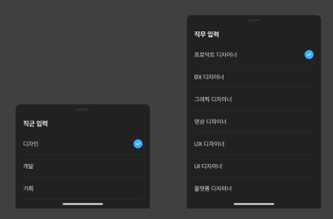
</div>

좌측은 모임 수정 시 활용되는 바텀시트이며, 우측은 회원 가입 과정에서 사용되는 바텀시트입니다. 회원 가입 기능을 개발하신 팀원께서 재사용 가능한 바텀시트를 이미 구현해두셨습니다. 따라서, 별도의 Compose 구현 과정 없이 **ViewModel을 통해 상태 관리**로 바텀시트를 효율적으로 관리하는 방식을 채택하였습니다.

```kotlin
    //MoimModifyFragment
    private fun observeBottomSheet() {
        viewModel.bottomSheet.flowWithLifecycle(lifecycle)
            .onEach {
                when(it) {
                    BottomSheet.Default -> {}
                    BottomSheet.Topic -> showTopicSheet()
                    BottomSheet.People -> showPeopleSheet()
                    else -> {}
                }
            }
            .launchIn(lifecycleScope)
    }
```

모임 수정 화면 컴포저블이 바인딩 되어있는 Fragment에서 ViewModel을 통해 State를 관찰하고 상황에 알맞는 바텀시트를 띄우는 함수를 호출합니다.
위와 같은 방식을 적용하면 **화면 활성 상태에 따라 emit된 데이터 수신 여부를 결정**하기 때문에 **리소스를 절약**할 수 있습니다. 

하지만 state를 관리하는 과정에서 다음과 같은 문제가 발생합니다.

<h3 style="background-color: #CABBFF; color: #ffffff; padding: 0.5em;"> 🤔 Default에서 Topic으로 변경되면 바텀시트가 올라오지만, 다시 클릭하면 올라오지 않아요. </h3>

위와 같은 문제는 Default -> Topic으로 **state가 변경된 이후 명시적으로 다시 Default로 리셋**하지 않았기 때문입니다. 이는 선택된 값의 유무로 로직을 적용하기에는 유저가 바텀 시트 외의 화면을 클릭한 다음 다시 토픽을 선택하는 케이스와 같이 예외 사항이 존재하여 한계가 있었습니다.

```kotlin
    //SingleModalBottomSheet
    override fun onDismiss(dialog: DialogInterface) {
        dismissListener?.onDismiss()
        focusedShowImageView?.setImageResource(R.drawable.ic_arrow_down_l)
        super.onDismiss(dialog)
    }

    //MoimModifyFragment
        val topicTitles = TopicType.values().map { it.title }
        topicBottomSheet = SingleModalBottomSheet.newInstance("모임 주제", topicTitles as ArrayList, topicClassListener
        ).apply {
            dismissListener = object: SingleModalBottomSheet.OnDismissListener {
                override fun onDismiss() {
                    viewModel.updateBottomSheet(BottomSheet.Default)
                }
            }
        }

```

이를 해결하기 위해 팀원이 작성했었던 **SingleModalSheet의 onDismiss 함수를 오버라이딩하여 상태를 변경**하는 방법을 사용했습니다. 바텀 시트가 닫힐 때 상태를 'Default'로 자동 리셋함으로써 기존 코드를 크게 변경하지 않으면서 원하는 기능을 적용할 수 있게 되었습니다.


<h3 style="background-color: #AA92FF; color: #ffffff; padding: 0.5em;"> 🚩 Problem 3 : 다크/라이트모드 설정마저 일반적인 방법과 다르다 </h3>

틈틈은 다크 모드를 기본으로 설정하여, 라이트 모드를 동시에 개발해야하는 프로젝트였습니다.
일반적으로 


<h3 style="background-color: #724CF9; color: #ffffff; padding: 0.5em;"> 🤔 웹뷰를 사용했습니다, 근데 너무 느린데요? </h3>


Daum 도로명 주소 검색 api를 사용하기 위해 자바 스크립트로 구성된 화면을 웹뷰에 띄우는 방식을 적용했습니다.

<div style="width: 100%; display: flex; justify-content: center; overflow-x: auto;">
        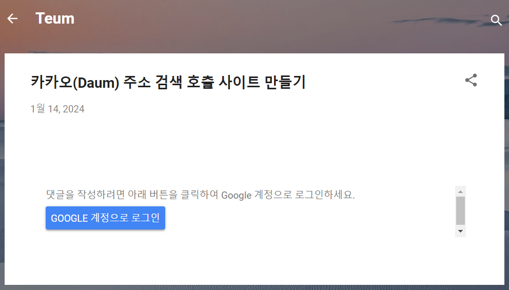
</div>

하지만 페이지가 완전히 로딩되기 전에 화면이 보여지면, **유저가 보지 않아도 되는 부분을 노출하게 되는 문제**가 발생했습니다.

```kotlin
    //WebviewFragment
        webViewClient = object : WebViewClient() {
            override fun onPageStarted(view: WebView?, url: String?, favicon: Bitmap?) {
                    binding.daumWebview.visibility = View.INVISIBLE
                    super.onPageStarted(view, url, favicon)
                }
                override fun onPageFinished(view: WebView, url: String) {
                    view.loadUrl("javascript:sample2_execDaumPostcode();")
                    handler.postDelayed({
                        binding.daumWebview.visibility = View.VISIBLE
                    }, 500)
                }
            }
```


유저가 보는 화면은 오직 도로명 주소 검색 페이지여야 하기 때문에 WebView의 **onPageStarted - onPageFinished** 함수를 이용하여 **완전히 로딩이 된 후 웹뷰 화면의 가시성을 전환**했습니다. 

이 방법은 사용자가 **2초 가량을 기다려야하는 불편함을** 초래했습니다. <br>
여러 번의 테스트를 통해 이 지연이 크게 문제 되지 않을 것이라 판단했지만, 런칭데이 행사에서 다양한 사용자들로부터의 피드백을 통해 이 문제를 인지하게 되었습니다. 

<div style="width: 100%; display: flex; justify-content: center; overflow-x: auto;">
        
</div>

**프로그래스바를 추가**함으로써, 페이지가 로드 중임을 명확히 표시하여 사용자가 페이지 로딩을 기다리는 동안 오류가 발생한 것으로 오해하지 않도록 했습니다. <br> 이 작은 변화로 **사용자의 체감 속도가 크게 개선**되었고, 이는 근본적인 해결책이 아닐 수도 있지만, **작은 변화가 사용자 경험에 큰 영향을 줄 수 있다**는 중요한 깨달음을 얻는 계기가 되었습니다.

<h3 style="background-color: #724CF9; color: #ffffff; padding: 0.5em;"> 🤔 멀티 모듈을 적용했습니다, 역시 빠릅니다 </h3>


## 틈틈하며 이런 부분에서 성장을 이뤘습니다 💫
---


기획 단계에서 역할을 분배할 때는 예상치 못했으나 틈틈의 볼륨은 예상보다 크다는 것이 가장 큰 난관이었습니다. 

<div style="width: 100%; display: flex; justify-content: center; overflow-x: auto;">
        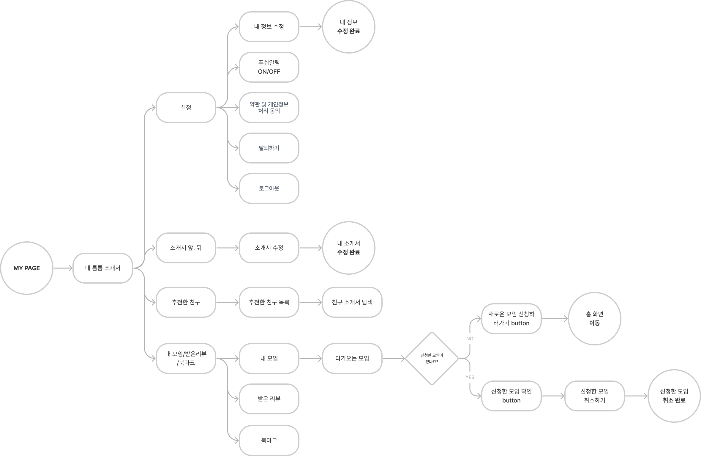
</div>

무엇보다 마이페이지의 플로우가 압도적이었고, 프로젝트가 끝나고 나서야 겨우 **'마이페이지가 하나의 애플리케이션이었다'**라는 우스갯소리를 할 수 있었던 것 같습니다. <br>

<div style="display: flex; justify-content: space-between;">
  <details style="flex: 1; margin-right: 10px;">
    <summary>모임 생성에 들어간 모든 화면과 기능</summary>
        <ul>
                <li>모임 토픽 선택</li>
                <li>모임 이름 작성</li>
                <li>모임 소개 작성
                    <ul>
                        <li>Multi part를 이용한 이미지 첨부 및 업로드 크기 제한</li>
                    </ul>
                </li>
                <li>모임 일정 작성
                    <ul>
                        <li>YYYYMMDD 로 입력 시, YYYY년 MM월 DD일 X요일로 자동 변환</li>
                        <li>00시 00으로 입력 시, 오후 00시 00분으로 자동 변환</li>
                    </ul>
                </li>
                <li>모임 장소 설정
                    <ul>
                        <li>도로명 주소 API 적용</li>
                    </ul>
                </li>
                <li>작성한 모임 정보 확인 및 생성</li>
            </ul>

  </details>


  <details style="flex: 1;">
    <summary>마이페이지에 들어간 모든 화면과 기능</summary>
       <ul>
                <li>내 틈틈 소개서</li>
                    <ul>
                        <li>내 틈틈 소개서 정보 수정</li>
                    </ul>
                <li>참여 모임 조회</li>
                    <ul>
                        <li>내가 생성한 모임 - 모임 수정하기</li>
                        <li>내가 생성한 모임 - 모임 삭제하기</li>
                        <li>내가 참여한 모임 - 참여 취소하기</li>
                        <li>내가 참여한 모임 - 모임 신고하기</li>
                    </ul>
                <li>북마크</li>
                <li>받은 리뷰 확인하기</li>
                <li>친구 추천하기(팔로잉)</li>
                    <ul>
                        <li>추천한 친구 목록 조회</li>
                        <li>추천한 친구 마이 페이지 조회</li>
                        <li>추천한 친구의 친구 조회</li>
                    </ul>
                <li>설정
                    <ul>
                        <li>내 정보 수정하기</li>
                        <li>푸시 알림 ON/OFF</li>
                        <li>약관 및 개인 정보 동의 웹뷰 연결</li>
                        <li>탈퇴하기</li>
                        <li>로그아웃</li>
                    </ul>
                </li>
            </ul>

  </details>

</div>


이렇게 많은 기능을 정해진 기간 내에, 여러 가지의 도전을 하는 프로젝트를 진행하는 것 역시 쉽게 할 수 있는 경험이 아니라고 생각합니다.
저는 틈틈 프로젝트를 진행하면서 아래와 같은 성장점을 느꼈습니다.

#### 💻 컴포즈를 쉽게 다룰 수 있게 되었어요 
틈틈을 시작하기 전, XML이 아닌 컴포즈를 이용해 UI를 제작하는 것이 조금 생소하다고 느꼈습니다. 운 좋게도 컴포즈를 XML과 함께 사용할 수 있는 기회를 얻게 되었고, 이 프로젝트를 진행하면서 컴포저블을 그리는 다양한 케이스를 겪고 좀 더 컴포즈를 친숙하게 다룰 수 있게 되었습니다. 

#### 🤔 프로젝트 진행 전 갖춰야할 세팅의 범위를 고민하게 되었어요 
단기간에 프로젝트를 완성하고 출시하는데 있어 많은 것들이 윤활제 역할을 했다고 느꼈습니다. <br>
- 깃허브와 슬랙을 연동하여 팀원의 작업상황을 한 눈에 확인
- github action에 CI/CD를 구축하여 PR 단위마다 인지하지 못했던 오류를 발견
- 멀티 모듈을 적용하여 빌드 시간 단축 <br>

위 세 가지는 프로젝트를 시작하기 앞서 세팅하는 과정이 추후 개발 진행에 영향력을 줄 수 있다는 것을 깨달았고, 다음 프로젝트 세팅 과정에서도 위 세 가지는 필수적으로 적용하는 것이 좋겠다는 판단을 했습니다. 

#### 🥰 동료의 열정이 결과물에 주는 영향력을 느꼈어요 
1차 릴리즈 전, 2주를 꼬박 새벽 작업을 하면서 지치는 순간도 많았지만 늦은 시간에도 피그마에 들어와있는 안드로이드, 디자인 팀원들과 문제가 발생했을때 빠르게 대처해주는 백엔드 팀원들이 있었기에 2차 릴리즈까지 성공적으로 해낼 수 있었다고 생각합니다. 


## 틈틈의 길은 계속된다 🫂
---

틈틈의 여정은 런칭 데이와 최종 발표 이후 받은 피드백을 통해 리팩토링의 필요성을 깨닫고 새로운 변화를 모색하는 과정으로 이어졌습니다. 이 과정에서 모든 팀원이 한마음으로 다시 모여 틈틈의 새로운 장을 열기로 결정했습니다.

서비스의 방향이 전혀 달라지더라도, 우리 팀 모두가 2024년 연초부터 한결같이 틈틈에 열정을 불태웠던 날들을 잊지 않았으면 합니다.

틈틈 포스트를 읽어주신 모든 분들께 진심으로 감사의 마음을 전합니다! 🥰

