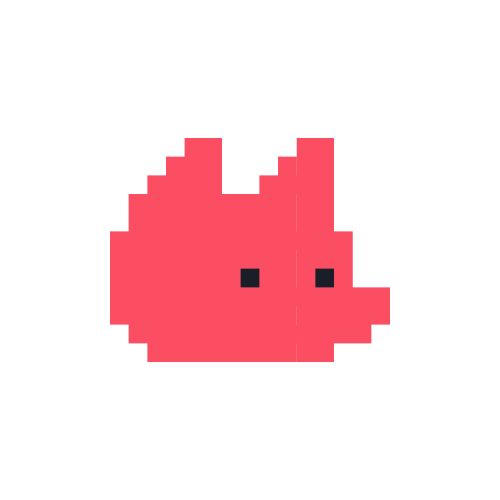

  
  

## 틈틈의 시작 🏃🏻‍♀️
---

    
    

11월부터 2월까지 디프만에서 틈틈이라는 프로젝트를 진행했습니다.
해당 프로젝트는 IT 업계에서 '커피챗'이라는 만연한 문화를 차용하여 **보다 쉽게 네트워킹을 할 수 있도록 하는 방법이 없을까?** 하는 아이디어에서 시작했습니다.

뿐만 아니라 처음 보는 사람들과의 어색함을 풀어내는 방법을 **chatGPT** 사용하여 참여하는 사람들의 관심사에 관련된 대화 주제를 카드 뽑기라는 재밌는 방법으로 풀어냈습니다. 

 

## 틈틈의 기능 🤔
---

  
### 모임 생성

  틈틈의 주 키워드는 바로 **모임** 입니다.

  1. 고민나누기 
  2. 모여서 픽업
  3. 스터디
  4. 사이드 프로젝트 

  네 가지의 토픽을 선택하여 원하는 장소에, 원하는 모임을 생성할 수 있습니다

### 모임 참여 
모임을 생성하는 것이 부담스럽다! 하는 분들은 생성된 모임에 참여할 수 있습니다.

 

## 틈틈의 개발자들 ⚒️
---

    <table style="width: 100%; max-width: 1000px; margin: auto; border-collapse: separate; border-spacing: 10px;">
        <tr>
            <th style="width: 25%; color:#724CF9">이강민</th>
            <th style="width: 25%; color:#724CF9">김우남</th>
            <th style="width: 25%; color:#724CF9">신민서</th>
            <th style="width: 25%; color:#724CF9">김세연</th>
        </tr>
        <tr>
            <td style="text-align: center;"></td>
            <td style="text-align: center;"></td>
            <td style="text-align: center;"></td>
            <td style="text-align: center;"></td>
        </tr>
        <tr>
            <td style="text-align: center;">모임 참여 & 유저 리뷰</td>
            <td style="text-align: center;">공통 관심사 찾기</td>
            <td style="text-align: center;">모임 생성 & 마이페이지</td>
            <td style="text-align: center;">로그인 & 자기소개 카드</td>
        </tr>
    </table>

