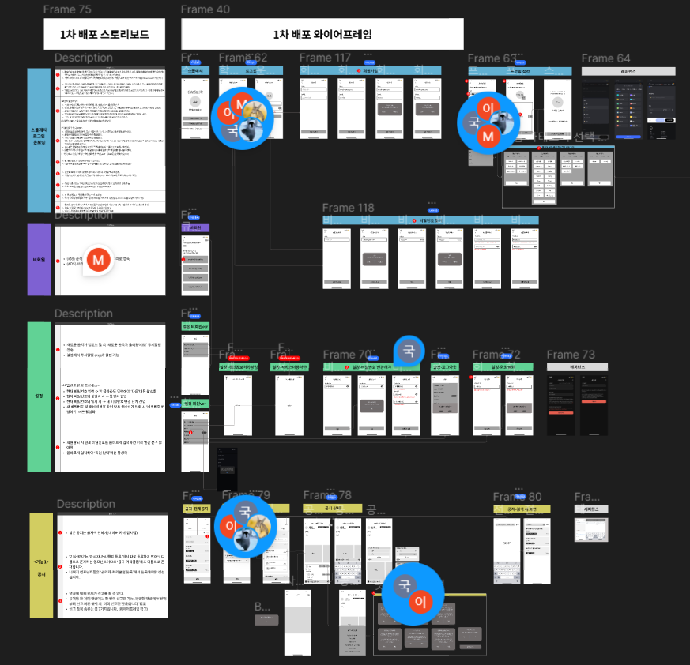
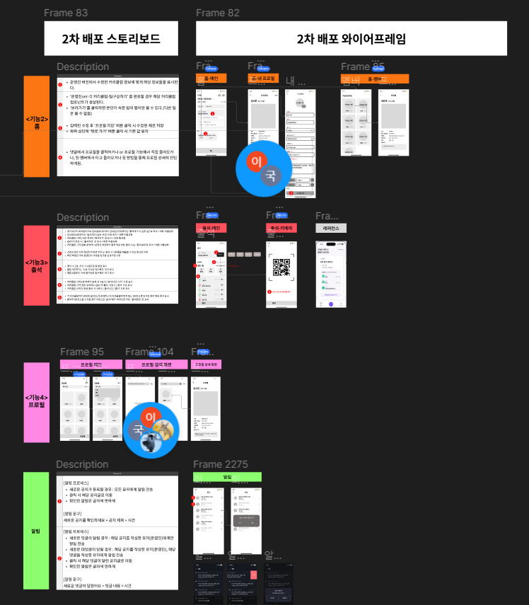
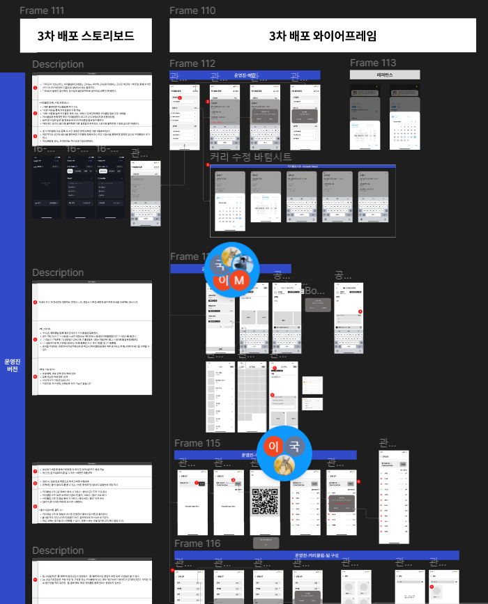

    
    👈🏻 Click me! 

# 목차 ✍🏻
---
1. [큐시즘 플러스의 시작과 그 여정 🏃🏻‍♀️](#큐시즘-플러스의-시작과-그-여정-)
2. [큐시즘 플러스의 기능 🤔](#틈틈의-기능-)
3. [큐시즘 플러스의 개발 정보⚒️](#틈틈의-개발-정보)
4. [개발하며 고민했던 이슈 🤝](#틈틈을-개발하며-고민했던-이슈-)
5. [아쉽게 마무리된 프로젝트를 회고하며 🫂](#틈틈하며-이런-부분에서-성장을-이뤄냈습니다-)

포스트에서 원하는 부분을 눌러 빠르게 읽어보세요! 

 

## 큐시즘 플러스의 시작과 그 여정 🏃🏻‍♀️ 
---

큐시즘 플러스는 2023년 8월에 결성되어 2024년 2월까지 진행한 중장기 프로젝트입니다. 
한국대학생IT경영학회, 즉 큐시즘이라는 연합 동아리를 일반 회원으로 한 기수, 운영진으로 한 기수, 총 두 기수동안 활동하며 **동아리 운영을 효율적으로 할 수 없을까?**라는 고민으로부터 출발하게 되었습니다. 
팀 구성원 중 과반수 이상이 두 기수 이상 활동한 회원인만큼 순수하게 큐시즘에 대한 애정으로 시작한 프로젝트라고 할 수 있습니다.

    
    
    

    <table style="width: 100%; max-width: 1000px; margin: auto; border-collapse: separate; border-spacing: 10px;">
        <tr>
            <th style="width: 25%; color:#266DFC">1차</th>
            <th style="width: 25%; color:#266DFC">2차</th>
            <th style="width: 25%; color:#266DFC">3차(운영진)</th>
        </tr>
    </table>

프로젝트는 구현 기능을 나눠 진행되었습니다.
