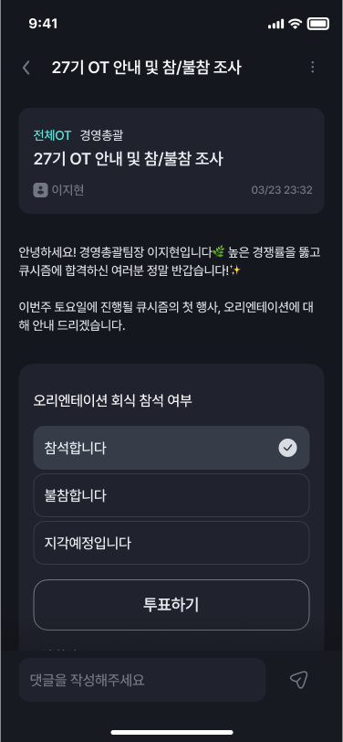
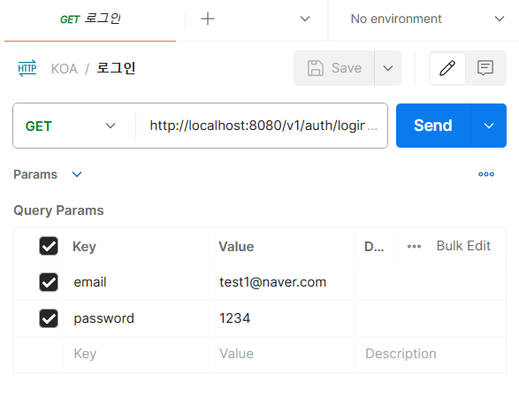

    
    👈🏻 Click me! 

# 목차 ✍🏻
---
1. [큐시즘 플러스의 시작과 그 여정 🏃🏻‍♀️](#큐시즘-플러스의-시작과-그-여정-)
2. [큐시즘 플러스의 기능 🤔](#큐시즘-플러스의-기능-)
3. [큐시즘 플러스의 개발 정보 ⚒️](#큐시즘-플러스의-개발-정보-)
4. [개발하며 고민했던 이슈와 해결 과정 🤝](#개발하며-고민했던-이슈와-해결-과정-)
5. [아프니까 청춘이다 🫂](#아프니까-청춘이다-)

포스트에서 원하는 부분을 눌러 빠르게 읽어보세요! 

 

## 큐시즘 플러스의 시작과 그 여정 🏃🏻‍♀️ 
---

큐시즘 플러스는 2023년 8월에 결성되어 2024년 2월까지 진행한 중장기 프로젝트입니다. 
한국대학생IT경영학회, 즉 큐시즘이라는 연합 동아리를 일반 회원으로 한 기수, 운영진으로 한 기수, 총 두 기수동안 활동하며 **동아리 운영을 효율적으로 할 수 없을까?**라는 고민으로부터 시작되어 팀원을 모집하고 최종적으로 큐시즘 공식 앱 TF팀으로 결성되어 여정을 시작하게 되었습니다. 
팀 구성원 중 과반수 이상이 두 기수 이상 활동한 회원인만큼 순수하게 큐시즘에 대한 애정으로 시작한 프로젝트이며, 저에게는 명령형 UI에서 선언형 UI로 기술을 전환하게 되는 첫 프로젝트이기에 의미가 더욱 깊다고 할 수 있습니다 🥰

    
    
    

    <table style="width: 100%; max-width: 1000px; margin: auto; border-collapse: separate; border-spacing: 10px;">
        <tr>
            <th style="width: 25%; color:#266DFC">1차</th>
            <th style="width: 25%; color:#266DFC">2차</th>
            <th style="width: 25%; color:#266DFC">3차(운영진)</th>
        </tr>
    </table>

동아리 운영에서 겪는 모든 불편함을 서비스로 해결하려는 목표 하에, 프로젝트의 범위가 상당히 넓었기 때문에, 개발 과정을 1차, 2차, 3차, 그리고 관리용 어드민 부분까지 나누어서 진행하게 되었습니다.

### 1차: 서비스의 기본 틀을 마련하다

첫 번째 배포에서는 **회원 로그인 기능, 비회원이 큐시즘을 탐색할 수 있는 공간, 그리고 공지사항과 커리큘럼을 확인할 수 있는 기본적인 기능**이 담긴 공간을 구축했습니다. 이번 프로젝트의 목표가 '원하는 기술을 모두 적용해보기'였기 때문에, 멀티 모듈, MVVM, Jetpack Compose 설정을 혼자 힘으로 완성하는 과정에서 많은 어려움을 겪었고, 이에 많은 시간이 소요되었습니다. 다음 기수의 커리큘럼이 시작되는 2월 말까지 개발을 마쳐야 했기에 진행 속도에 대한 부담감을 느끼던 중, 이전에 넥스터즈 프로젝트를 함께했던 개발자 한 명을 팀에 영입하게 되면서 프로젝트 진행에 탄력을 받게 되었습니다.

### 2차: 세부 기능을 구현하다 

두 번째 배포는 첫 번째 배포 일정에 맞추어 연기되었던 **세부 기능들(신고, 알림, 공지글 내 투표 기능), 댓글 및 대댓글 기능, 회원 프로필 검색 및 팀 매칭 기능, 그리고 출석 체크 기능**을 포함하여 추가적인 기능들을 구현하는 단계였습니다.

### 3차: 운영진 버전, 그리고 관리자 어드민 

운영진 버전의 필요성은 새로운 기수의 학회원 명단, 공지 사항, 명단 이외의 실수로 탈퇴한 회원의 재가입 프로세스와 같은 내용을 엑셀을 직접 DB에 넣어 관리해야 하는 번거로움에서부터 출발했습니다. 

 

## 큐시즘 플러스의 기능 🤔
---

### 로그인, 온보딩 프로세스 

    
    
     

처음 큐시즘 플러스를 이용하기 위해서는 DB에 회원 정보가 존재해야 합니다.
이메일과 초기 비밀번호인 생년월일을 입력해서 로그인 요청을 보내면, 처음 로그인을 하는 유저인지 확인하는 과정을 통해 온보딩 프로세스에 접근할 수 있습니다.  

온보딩 프로세스는 큐시즘의 회원 정보를 채우는 과정입니다. 서버에 입력되어있는 **이메일과 전화번호를 제외한 전공과 파트, 관심 카테고리**는 필수 입력 정보입니다 ✔️

다음은 추가 프로필 설정으로 원하신다면 설정하지 않고도 기본 프로필 이미지로 회원 가입이 가능합니다! 추가 프로필 설정에 특이사항이 있다면 **나의 링크**에서 내 깃허브, 티스토리 링크를 추가하여 프로필에 띄울 수 있습니다 

    

모든 입력을 마치고 나면 회원가입이 완료됩니다!
개인적으로 이번 프로젝트를 진행하며 채연님의 디자인이 **사용자 경험**에 굉장히 신경 썼다는 부분을 알 수 있어 흥미로웠어요(뿐만 아니라 디자인 천재이기도 합니다). 개발 과정과 QA 테스트를 진행하면서, 사용자 플로우에 혼란이나 **실수로 인한 클릭이 거의 발생하지 않는다는 점**을 몸소 체험했습니다.
이는 개발자로서, 사용자 경험이 얼마나 중요한지 다시 한번 생각해보는 계기가 되었습니다!

### 큐시즘이 궁금해요 🤗, 비회원 공간 

    
    

비회원도 큐시즘을 자유롭게 탐색할 수 있는 공간을 마련했습니다🪄

로그인 화면에서 **'큐시즘 둘러보기'**를 선택하면, 큐시즘의 모든 정보를 한 눈에 확인할 수 있습니다. 큐시즘의 공식 홈페이지, 인스타그램, 유튜브, 그리고 카페로 이어지는 웹뷰를 통해, 큐시즘에 대해 궁금한 점이 있는 분들이 쉽게 정보를 얻고 탐색할 수 있도록 구현했습니다.

### 홈화면 - 공지 및 커리큘럼 확인 ✔️

    
    
    

그동안 큐시즘 안에서 공지는 카카오톡 게시글이나, 노션으로 작성된 글을 공유하는 방식으로 이뤄졌습니다. 그로 인해, 이전에 올라왔던 공지를 확인하는데 혼동이 발생하거나 쌓여서 찾기 어려운 경우가 발생해 이제는 공지, 커리큘럼을 모두 큐시즘 플러스에서 확인할 수 있도록 구현했습니다!

전체 공지 공간에서는 운영진이 업로드하는 공지 내용을 확인할 수 있습니다. 뿐만 아니라 행사 불참을 조사해야하는 경우, 투표 기능을 이용해 카카오톡의 투표 기능을 사용하지 않고도 큐시즘 안에서 모든 것을 해결할 수 있습니다.

커리큘럼 공간에서는 한 기수의 모든 커리큘럼을 확인할 수 있고, 검색을 통해 원하는 공지를 다시 확인할 수 있습니다.

### 홈화면 - 출석 체크 🕵🏻‍♀️

    
    
    

### 홈화면 - 회원 프로필 확인 및 나의 프로필 수정 

    
    

 

## 큐시즘 플러스의 개발 정보⚒️
---

    <table style="width: 100%; max-width: 1000px; margin: auto; border-collapse: separate; border-spacing: 10px;">
        <tr>
            <th style="width: 25%; color:#266DFC">정석준</th>
            <th style="width: 25%; color:#266DFC">신민서</th>
            <th style="width: 25%; color:#266DFC">김아린</th>
        </tr>
        <tr>
            <td style="text-align: center;"></td>
            <td style="text-align: center;"></td>
            <td style="text-align: center;"></td>
        </tr>
        <tr>
            <td style="text-align: center;">공지/커리큘럼, 검색</td>
            <td style="text-align: center;">로그인, 출석체크, 비회원, 설정</td>
            <td style="text-align: center;">팀 조직, 마이 프로필 수정</td>
        </tr>
    </table>

큐시픔 플러스를 개발하는 팀 KOA는 기획 둘, 디자인 하나, iOS 둘, AOS 3, 서버 2, 어드민 1 총 11명의 사람들로 이뤄져있습니다! 그 중 안드로이드 파트는 세 명이 나눠 개발을 진행했는데요, 석준님은 넥스터즈에서 프로젝트를 함께 진행했던 안드로이드 개발자분으로 안드로이드를 개발하며 생기는 궁금증을 답변 해주시는 제 스승님이라고 할 수 있습니다 🪄 

석준님은 1차 막바지, 아린님은 2차에 합류를 하게 되어 각자 파트를 맡아 개발을 진행했습니다.

  
주요 기술 스택 및 프로젝트 구조는 다음을 눌러 확인해주세요

  

    
    

## 개발하며 고민했던 이슈와 해결 과정 🤝
---

<h3 style="background-color: #266DFC; color: #ffffff; padding: 0.5em;"> 🫠 초기 세팅과 Base 작업</h3>

1차 개발을 시작한 이후 약 세 달이라는 시간을 혼자 개발을 진행했기 때문에, 

<h3 style="background-color: #266DFC; color: #ffffff; padding: 0.5em;"> ⛈️ 자동 로그인이 되지 않는다? 토큰 인터셉터 조정</h3>

    

사실 자동 로그인은 1차 개발에서부터 이미 구현된 기능이었습니다. 그러나 2차를 개발을 완료하고 QA를 진행하며 자동 로그인이 동작하지 않는 것 같은 의심이 들기 시작했습니다.

서버 개발자의 의도에 따라 달라질 수 있으나, 큐시즘 플러스의 Access Token의 만료 기한은 1시간, Refresh Token은 일주일이었습니다. 그러나 개발을 진행하며 1시간이 지나면 데이터를 받아오는 요청이 제대로 수행되지 않음을 인지했고, 수정 작업에 들어갔습니다.

기본적인 구현 정보는 아래와 같습니다!

    

<h3 style="background-color: #266DFC; color: #ffffff; padding: 0.5em;"> 🤔 API에 대한 고민,, 멱등성?</h3>

    

서버에 요청을 보낼때, API 규격에 따라 정보를 쿼리 스트링에 담아 전송하는 경우가 종종 있습니다. 예를 들어, 구글 검색 URL에서 **search?=멱등성** 부분을 보면, 검색어가 첫 번째로 요청에 담긴 쿼임을 쉽게 추측할 수 있습니다.

    

직관적으로 이해하기 쉽다는 것 뿐만 아니라 쿼리 스트링에에 데이터를 담아 요청을 보내는 것은 **서버의 구현 난이도가 쉽고, 클라이언트의 테스트가 용이하기 때문**에 저 역시 대부분의 프로젝트에서 정보를 쿼리 스트링에 담아 요청하는 방식을 사용했었습니다.

개발 과정에서 요청에 대한 응답이 오는 것을 확인하기 위해 우리는 swagger나 Postman을 사용하게 되는데, 여기서도 Access Token만 주기적으로 바꿔주기만 하면 쉽게 테스트를 진행할 수 있기 때문입니다.

    

그런데 갑자기 개발 도중, 서버에서 API를 대대적으로 수정했다는 메시지가 도착했습니다.

    

말씀해주신 API는 모두 1차에서 제가 맡은 기능이었기에 작업했던 통신 메서드를 직접 수정하게 되었는데요,
서버에서 수정한 API들은 다음과 같은 특징이 있었습니다. 

<ul>
    <li> Http 메서드를 POST에서 GET으로 수정</li>
    <li> 쿼리가 아닌 json Body에 데이터를 담아 요청</li>
</ul>

**요청을 GET으로 처리한다?** 처음 보는 방식이었기에 왜 이런 방식으로 수정했는지 물어보지 않을 수 없었습니다.  그에 대한 서버 개발자의 답변은 **멱등성** 이슈로 다음과 같이 수정했다고 말씀하셨습니다.

    
    

멱등성, 처음 들어보는 단어였기에 어드민 개발자 분이 보내주신 내용을 참고해 살펴보았습니다. 서버분의 답변과, 서칭해본 내용을 기반으로 메서드를 수정한 이유는 다음과 같습니다.

<ul>
    <li> 수정된 API는 리소스를 생성하는 것이 아닌, 서버에서 값을 조회하는 API다</li>
        <ul>
            <li>따라서 POST와 같이 데이터를 전송하여 리소스를 생성하는 메서드는 적합하지 않음</li>
            <li>GET으로 전환함에 따라 발생할 수 있는 보안 이슈는 requestBody로 전환하여 해결 </li>
        </ul>
     
</ul>

이렇게 API를 수정함에 따라 Postman으로 API를 테스트 하는 과정이 한층 어려워졌습니다.
하지만 어렵다는 것은 **로그로 데이터를 파악하기 어려워졌다는 것**을 의미하기 때문에, 오히려 보안 측면에서는 더 나아졌다고 할 수 있을 것 같습니다! 

    

하지만 서버분의 의도와는 다르게 클라이언트, 즉 **안드로이드에서는 GET 호출에서 Request Body가 가능하지 않았습니다.** 수정한 API를 적용해본 결과, GET은 request Body를 가져선 안된다라는 로그를 발견하며 그 이유를 알게 되었는데요

[서칭 결과,](https://jsdevlog.tistory.com/entry/OKHttp-method-GET-must-not-have-a-request-body-%EC%97%90%EB%9F%AC) okhttp의 2020년 2월 최신 버전(3.11.0) 기준으로 **GET 방식 호출에서는 body를 붙이는 것을 허용해주지 않는다고 합니다.** 2014년 이전의 HTTP 요청 메시지에는 body를 허용하나, 이 역시 throw를 통해 원하는 응답을 받을 수 없게 될 확률이 높습니다. 이로 인해 아쉽게도 적용을 하지 못하고 POST 메서드로 Request Body에 데이터를 담아 전송하는 것으로 마무리 되었습니다.

서버 분의 새로운 시각과, 알지 못했던 개념을 깨우치게된 경험이었습니다. 이 글을 빌어 멱등성이라는 개념을 잘 풀어 설명해주신 경민님과 좋은 인사이트를 주신 세은님께 감사드립니다 🥰

 

## 아프니까 청춘이다 🫂
---

    

큐시즘 프로젝트는 새 기수의 두 관리자와의 이해 관계에서 발생한 충돌로 인해 iOS 버전은 출시를 완료했지만, 안드로이드 버전은 플레이 스토어 등록 과정에서 프로젝트가 중단되었습니다. 

  

    
큐시즘 플러스를 개발하며 달성한 그랜드 슬램 🎉

         <ul>
                <li>20회의 정기 회의, 6회의 서브회의</li>
                <li>피그마 13페이지 분량의 디자인</li>
                <li>4만 줄 가량의 코드 중 22000줄 기여</li>
                <li>3학년 2학기의 모든 공강 시간을 도서관에서 개발하는데 투자하기💻</li>
                <li>연말 휴가차 필리핀과 한국을 오가는 새벽 비행기 안에서 개발하기💻</li>
                <li>설 연휴 고속 버스에서 개발하기 💻 </li>
                <li>연휴 4일 내내 새벽에 밤 새서 개발하기💻</li>
        </ul>
  

공개적으로 세부 내용을 밝히기 어렵지만, 갑작스러운 개발 중단 소식은 프로젝트에 참여한 모든 이에게 큰 아쉬움으로 남았습니다. 특히, 보수를 바라지 않고 순수한 애정과 재능 기부 차원에서 참여한 팀원들에게 이는 더욱 큰 충격이었습니다.

### 모든 경험에는 배울 것이 존재한다
---

  

    
 

 `민서야, 이게 학생 단체가 아니라 회사였다면 어떻게 할거야?`

힘든 시기를 겪으며, 주변의 조언도 큰 위로가 되지 못했습니다. 하지만 아버지와의 대화를 통해 학생 단체뿐만 아니라 **어느 조직에서든 이해 관계가 얽힌 결정에 직면할 수 있다는 것**을 깨달았습니다. 이러한 깨달음은 **안드로이드 팀장으로서 책임감**을 더욱 느끼게 해주었습니다. 비로소 팀원들의 감정을 살피며 프로젝트를 마무리하는 데 중점을 두었으며 추후에 팀원들과의 오프라인 모임을 통해 서로를 위로하고 격려하는 시간을 가질 수 있었습니다. 

이번 경험을 통해 개발자로서뿐만 아니라 **리더로서, 팀원으로서 성장할 수 있는 중요한 교훈**을 얻었습니다. 학생 단체에서 이러한 경험을 미리 할 수 있었던 것은, 리더십과 팀워크의 중요성을 배울 수 있는 소중한 기회였습니다.

첫 커리어의 시작은 교내 개발 동아리 탈락의 경험이었던 것처럼, **성장 과정에는 언제나 시련이 동반됩니다.** 이번 경험을 통해 얻은 교훈은 앞으로의 여정에 있어 더욱 의미 있는 발판이 될 것이라 생각합니다. 리더로서, 개발자로서, 그리고 팀원으로서 한 단계 더 성장한 제 자신에게 고마움을 전하며, 이 글을 마칩니다.

큐시즘 포스트를 모든 읽어주신 분들께 진심으로 감사의 마음을 전합니다 😊

 