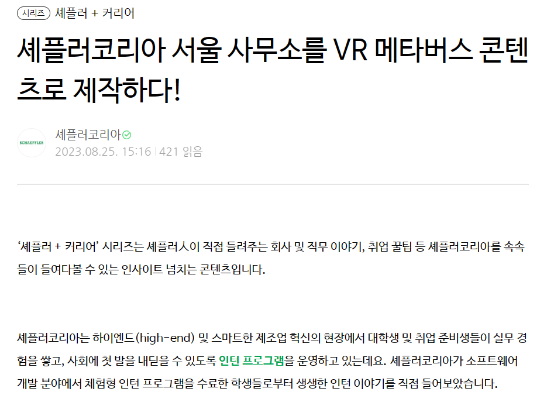

<!-- ---
title: 인턴쉽, 대화형 메타버스 플랫폼 개발을 진행하다
description: 새로운 도메인과 기술, 즐겁다(?)
image: schaeffler/schaeffler_1.jpg
date: 2024-03-01
author: Mnseo
comments: enabled
---

    
     👈🏻 셰플러 공식 블로그에서 인턴쉽 인터뷰를 확인해보세요!

# 목차 ✍🏻
---
1. [너, 안드로이드 개발자 아니야? 인턴쉽의 시작 🏃🏻‍♀️](#너-안드로이드-개발자-아니야-인턴쉽의-시작-)
2. [진행한 프로젝트의 정보 🤔](#진행한-프로젝트의-정보-)
4. [개발하며 고민했던 이슈와 해결 과정 🤝](#개발하며-고민했던-이슈와-해결-과정-)
5. [6개월의 인턴을 마치며 🫂](#6개월의-인턴을-마치며-🫂)

포스트에서 원하는 부분을 눌러 빠르게 읽어보세요! 

 

##  너, 안드로이드 개발자 아니야? 인턴쉽의 시작 🏃🏻‍♀️ 
---

**🧨 참고:  이 파트는 인턴쉽을 하게 된 계기에 관련된 파트로, 사담이 많습니다**

2023년 초는 돌이켜 생각해보면 가장 혼란이 많았던 시기였다. 2022년 1학기 전공에 대해 회의감을 느끼고 휴학을 하고 2학기에 다시 복학하여 일년 만에 수많은 프로젝트와 경험을 하게 되었고, 학업과 사이드 프로젝트 사이의 간극은 계속 벌어져만 갔다. 사이드 프로젝트를 하면 너무 즐겁고 재밌지만, 학교 공부는 재미가 없었고 무엇보다 취업 준비를 위해 안드로이드 관련 직무에 인턴을 해야겠다는 알 수 없는 욕망이 끓어올랐다.

하지만 정말 놀랍게도, 수많은 사이트들(Ex. X퍼루키, 링X리어, 구글 통합검색)을 뒤져도 안드로이드의 자리는 아무데도 없었다. 그러던 와중 발견한 것이 이 공고였고, 

 `어플리케이션? 지금 하고 있는거잖아. 괜찮네`

정말 인턴이 너무 하고 싶다는 생각에 사로잡혀 무턱대고 이력서와 포폴을 고쳐서 마감 하루 전에 지원을 마쳤다. 지원 이틀 만에 서류를 붙었다는 연락이 오고, 난생 처음 높은 빌딩들로 가득한 여의도로 면접을 보러 갔다. 면접을 보고 3일 만에 언제 출근할 수 있냐는 연락이 왔고, 일사천리로 설날 연휴가 끝나고 바로 다음 날에 출근하기로 확정을 지었다.

내가 지원한 직무는 '제조업' 아래에 있는 'IT 부서'의 '새로운 프로젝트'였고, 나는 한국 소속 직원이나, 프로젝트 매니저님과 모든 관련 직원은 싱가폴에 있는 아시아&퍼시픽 지부 사람들이었다. 한국에서 같이 프로젝트를 진행하는 사람은 2개월 정도 빨리 입사한 가나 국적의 인턴 동기가 유일했다. 계약 기간이 6개월로 꽤나 긴 시간이었기 때문에, 첫 달은 안에 있는 C# 강의를 들으며 미니 사이드 프로젝트를 진행하고 여유롭게 보냈으나 그 다음부터는 고난의 연속이었다.

##  진행한 프로젝트의 정보 🤔 
---

## 개발하며 고민했던 이슈와 해결 과정 🤝
---

## 6개월의 인턴을 마치며 🫂
---

새로운 도메인에서, 새로운 언어로, 새로운 기술을 사용해서 혼자 결과물을 만들어내는 작업은 너무나도 힘든 작업이었습니다. 개발에 있어 직접적으로 도움을 받을 사람이 없었기에 돌아보면 외로운 싸움이었다고 생각이 듭니다. 하지만 

 -->
